<div id="top"></div>

<!-- TABLE OF CONTENTS -->
<summary>Table of Contents</summary>
<ol>
    <li>
        <a href="#about-the-project">About The Project</a>
        <ul>
            <li><a href="#folder-structure">Folder Structure</a></li>
            <li><a href="#capstone-datasets">Capstone Datasets</a></li>
            <li><a href="#tools-used">Tools Used</a></li>
            <li><a href="#getting-started">Getting Started</a></li>
        </ul>
    </li>
    <li>
        <a href="#design-considerations">Design Considerations</a>
        <ul>
            <li><a href="#data-exploration">Data Exploration</a></li>
            <li><a href="#data-model">Data Model</a></li>
            <li><a href="#schema-design">Schema Design</a></li>
            <li><a href="#etl-pipeline">ETL Pipeline</a></li>
            <li><a href="#data-quality">Data Quality</a></li>
        </ul>
    </li>
    <li>
        <a href="#use-case">Use Case</a>
        <ul>
            <li><a href="#use-case-1">Use Case 1: Top 5 Countries who visited US in 2016</a></li>
            <li><a href="#use-case-2">Use Case 2: Top 5 Cities visited in 2016</a></li>
            <li><a href="#use-case-3">Use Case 3: Travelling Patterns with Season</a></li>
        </ul>
    </li>
    <li>
        <a href="#scenario-study">Scenario Study</a>
        <ul>
            <li><a href="#scenario-1">Scenario 1: Data increased by 100x</a></li>
            <li><a href="#scenario-2">Scenario 2: Data must be updated on a daily basis by 7am every day</a></li>
            <li><a href="#scenario-3">Scenario 3: Data need to be accessed by 100+ people</a></li>
        </ul>
    </li>
    <li><a href="#acknowledgments">Acknowledgments</a></li>
</ol>
<br/>

<!-- ABOUT THE PROJECT -->
# About The Project

This project is part of the assignment for the *Capstone Assignment* for the Udacity Data Engineering course.

This is the requirement for the assignment
> In the Udacity provided project, you'll work with four datasets to complete the project. The main dataset will include data on immigration to the United States, and supplementary datasets will include data on airport codes, U.S. city demographics, and temperature data. You're also welcome to enrich the project with additional data if you'd like to set your project apart.

<p align="right">(<a href="#top">back to top</a>)</p>

<!-- Folder Structure -->
## Folder Structure

The following are the files that will be found in this submission

```
. 
├── data 
│   └── *.sas7bdat #Immigration Data
├── data2 
│   └── GlobalLandTemperaturesByCity.csv #Temperature Data
└── home/workspace
    ├── Capstone Project.ipynb #Main Notebook
    ├── README.md              #Readme
    ├── screenshots            #Images for Readme
    ├── immigrate_data         #Pyspark Temp Folder
    ├── sas_data               #Pyspark Temp Folder
    ├── dataset                #All Other Datasets Folder
    ├── config.ini             #Py Script Configuration
    ├── config_loader.py       #Load Config Py Script
    ├── create_tables.py       #Create Table Py Script
    ├── check_tables.py        #Data Quality Py Script
    ├── select_queries.py      #Use Case Py Script
    ├── drop_tables.py         #Drop Table Py Script
    └── sql_queries.py         #Queries Py Script
```

<p align="right">(<a href="#top">back to top</a>)</p>

<!-- Capstone Datasets -->
## Capstone Datasets

The following are the datasets that will be used:
1. 194 Immigration Data
2. World Temperature Data
3. US City Demographic Data
4. Airport Code Data

<br />

### 194 Immigration Data
The `194 Immigration Data` is stored in parquet format in the *sas7bdat* files.A sample of the data could be found in *immigration_data_sample.csv*

It contains the arrival and departure data for non-us citizens visiting America

The following is the data dictionary for `194 Immigration Data`:

| Name | Description | Type |
| --- | --- | --- |
| cicid | Identifier for the I94 | Decimal |
| i94yr | Arrival Year | Decimal |
| i94mon | Arrival Month | Decimal |
| i94cit | Citizenship | Decimal |
| i94res | Residence | Decimal |
| i94port | Arrival Airport | String |
| arrdate | Arrival Date in the USA | Decimal |
| i94mode | Model of Transport: <br/> 1 = 'Air' <br/> 2 = 'Sea' <br/> 3 = 'Land' <br/> 9 = 'Not reported' | Decimal |
| i94addr | Country Code | String |
| depdate | Departure Date from the USA | Decimal |
| i94bir | Age of Respondent in Years | Decimal |
| i94visa | Visa codes collapsed into three categories: <br/>1 = Business <br/>2 = Pleasure <br/> 3 = Student| Decimal |
| count | Used for summary statistics | Decimal |
| dtadfile | Date added to I-94 Files | String |
| visapost | Department of State where where Visa was issued | String |
| occup | Occupation that will be performed in U.S. | String |
| entdepa | admitted or paroled into the U.S. | String |
| entdepd | Departed, lost I-94 or is deceased | String |
| entdepu | Either apprehended, overstayed, adjusted to perm residence | String |
| matflag | Match of arrival and departure records | String |
| biryear | 4 digit year of birth | Decimal |
| dtaddto | Character Date Field - Date to which admitted to U.S. (allowed to stay until) | String |
| gender | Non-immigrant sex | String |
| insnum | INS number | String |
| airline | Airline used to arrive in U.S. | String |
| admnum | Admission Number | Decimal |
| fltno | Flight number of Airline used to arrive in U.S. | String |
| visatype | Class of admission legally admitting the non-immigrant to temporarily stay in U.S. | String |

<br />

The following is a sample of the data for `194 Immigration Data`:
```
2027561,4084316.0,2016.0,4.0,209.0,209.0,HHW,20566.0,1.0,HI,20573.0,61.0,2.0,1.0,20160422,,,G,O,,M,1955.0,07202016,F,,JL,56582674633.0,00782,WT
```
<br />

### World Temperature Data
The `World Temperature Data` is stored in *GlobalLandTemperaturesByCity.csv*

It contains the land temperature that was recorded over the years

The following is the data dictionary for `World Temperature Data`:

| Name | Description | Type |
| --- | --- | --- |
| dt | Date at which the temperature is recorded  | Date |
| AverageTemperature | Average Temperature which was recorded in Celcius | Decimal |
| AverageTemperatureUncertainty | Possible Deviation of the Average Temperature (95% confidence interval) | Decimal |
| City | City at which the Temperature is recorded | String |
| Country | Country at which the Temperature is recorded | String |
| Latitude | Latitude of the Location | String |
| Longitude | Longitude of the Location | String |
<br />

The following is a sample of the data for `World Temperature Data`:
```csv
1743-11-01,6.068,1.7369999999999999,Århus,Denmark,57.05N,10.33E
```
<br />

### US City Demographic Data
The `US City Demographic Data` is stored in *us-cities-demographics.csv*

It contains the demographics of all US cities and census-designated places with a population greater or equal to 65,000, based on the US Census Bureau's 2015 American Community Survey

The following is the data dictionary for `US City Demographic Data`:

| Name | Description | Type |
| --- | --- | --- |
| City | City at which the population is measured | String |
| State | State at which the population is measured | String |
| Median Age | Median age of the population in the location | Decimal |
| Male Population | Total Males in the location | Integer |
| Female Population | Total Females in the location | Integer |
| Total Population | Total Population in the location | Integer |
| Number of Veterans | Total Veterans in the location | Integer |
| Foreign-born | Total Foreigners in the location | Integer |
| Average Household Size | Average Household Size in the location | Decimal |
| State Code | State Code of the location | String |
| Race | The race in the location | String |
| Count | Total Number of Population based on the Race | Integer |
<br />

The following is a sample of the data for `US City Demographic Data`:
```
Silver Spring;Maryland;33.8;40601;41862;82463;1562;30908;2.6;MD;American Indian and Alaska Native;1084
Silver Spring;Maryland;33.8;40601;41862;82463;1562;30908;2.6;MD;Asian;8841
Silver Spring;Maryland;33.8;40601;41862;82463;1562;30908;2.6;MD;Black or African-American;21330
Silver Spring;Maryland;33.8;40601;41862;82463;1562;30908;2.6;MD;Hispanic or Latino;25924
Silver Spring;Maryland;33.8;40601;41862;82463;1562;30908;2.6;MD;White;37756
```
<br />

### Airport Code Data
The `Airport Code Data` is stored in *airport-codes_csv.csv*

It contains the list of all airport codes, the attributes are identified in datapackage description. Some of the columns contain attributes identifying airport locations, other codes (IATA, local if exist) that are relevant to identification of an airport.

The airport codes may refer to either IATA airport code, a three-letter code which is used in passenger reservation, ticketing and baggage-handling systems, or the ICAO airport code which is a four letter code used by ATC systems and for airports that do not have an IATA airport code (from wikipedia).

The following is the data dictionary for `Airport Code Data`:
| Name | Description | Type |
| --- | --- | --- |
| ident | Identifier to differentiate the IATA Codes | String |
| type | Type of Airport | String |
| name | Name of Airport | String |
| elevation_ft | Height of Airport | String |
| continent | Continent of Airport | String |
| iso_country | Country of Airport | String |
| iso_region | Region of Airport | String |
| municipality | Municipality of Airport | String |
| gps_code | GPS Code of Airport | String |
| iata_code | IATA Code of Airport | String |
| local_code | Local Code of Airport | String |
| coordinates | Coordinates of Airport | String |
<br/>

The following is a sample of the data for `Airport Code Data`:
```csv
00A,heliport,Total Rf Heliport,11,NA,US,US-PA,Bensalem,00A,,00A,"-74.93360137939453, 40.07080078125"

00AA,small_airport,Aero B Ranch Airport,3435,NA,US,US-KS,Leoti,00AA,,00AA,"-101.473911, 38.704022"
```
<br />

<p align="right">(<a href="#top">back to top</a>)</p>

<!-- Tools Used -->
## Tools Used
The following are the tools/libraries that will be used:
1) Pandas
2) Spark
3) PostgreSQL

<br/>

`Pandas` will be use to load the `World Temperature Data`, 
`US City Demographic Data`, `Airport Code Data`. In order to use `Pandas`, please ensure `pip` is installed and that the `pandas` library is installed via `pip`

<br/>

`Spark` will be use to load the `194 Immigration Data`, which is in parquet format and is in millions of rows. In order to run `Spark`, please ensure that spark cluster is either installed or the standalone mode is setup.

<br/>

`PostgreSQL` will be use to store the proceessed data for future analysis. In order to run `PostgreSQL`, please ensure the the postgresql database is installed.

<p align="right">(<a href="#top">back to top</a>)</p>

<!-- GETTING STARTED -->
## Getting Started

The data exploration is done in jupyter notebook in `Capstone Project Template.ipynb`, whereas the database logic is coded in to the respective python scripts.

<br/>

### Python Scripts

The following are the python scripts for the database logic:

| Scripts | Purpose | Execution |
| --- | --- | --- |
| `create_tables.py` | Create the tables for the database | python3 `create_tables.py` |
| `check_tables.py` | Check the records have inserted into the tables | python3 `check_tables.py` |
| `select_queries.py` | Query to check for answers on some of the use case | python3 `select_queries.py` -c [CASE_ID] |
| `drop_tables.py` | Housekeep tables | python3 `check_tables.py` |

<br/>

Before execution of the python scripts, please update the config file in `config.ini`. Replace those `<>` with the actual values.

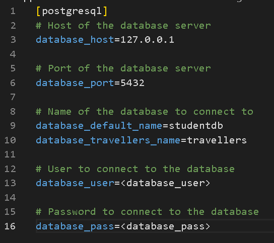

<br/>

### Jupyter Notebook

Launch the `Capstone Project.ipynb` jupyter notebook and run cell by cell to get the output.

Before execution of the notebook, please update the database configuration at the beginning of the cells

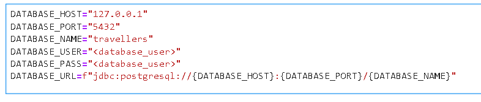

<br/>

<p align="right">(<a href="#top">back to top</a>)</p>

<!-- Design Considerations -->
# Design Considerations

The following are some design considerations:
1) Data Exploration *(What are the data we have)*
2) Data Model *(What are the tables we derive)*
3) Schema Design *(How should we create the tables)*
4) ETL Pipeline Design *(How should we insert the data)*
5) Data Quality *(Are we creating the tables right)*

<p align="right">(<a href="#top">back to top</a>)</p>

<!-- Data Exploration -->
## Data Exploration

The following are the available datasets:
1) 194 Immigration Data
2) World Temperature Data
3) US City Demographic Data
4) Airport Code Data

<br/>

### 194 Immigration Data
First, we will load in the data from the `*sas7bdat` files and perform the following exploratory actions:

1) Check Content/Columns of the Data
2) Check Total Count of the Data
3) Convert `arrdate` and `depdate` from SAS Numeric date to readable dates
4) Group Travellers By Their *Travelling Purpose*

<br/>

### World Temperature Data
First, we will load in the data from the `GlobalLandTemperaturesByCity.csv` and perform the following exploratory actions:

1) Check Content/Columns of the Data
2) Check Total Count of the Data
3) Filter `country` to only extract *US* related information
4) Drop Duplicates and Empty Rows
5) Generate `month_name` from `month`
6) Generate `season` from `month_name`
7) Group Temperatures by `Cities`

<br/>

### US City Demographic Data
First, we will load in the data from the `us-cities-demographics.csv` and perform the following exploratory actions:

1) Check Content/Columns of the Data
2) Check Total Count of the Data
3) Drop Duplicates and Empty Rows
4) Group Population by `Cities`

<br/>

### Airport Code Data
First, we will load in the data from the `airport-codes_csv.csv` and perform the following exploratory actions:

1) Check Content/Columns of the Data
2) Check Total Count of the Data
3) Filter `iso_country` to only extract *US* related information
4) Drop `iso_region` which looks abnormal
5) Generate `state` from `iso_region`
6) Generate `coordinates_x` and `coordinates_y` from `coordinates`

<br/>

<p align="right">(<a href="#top">back to top</a>)</p>

<!-- Data Model -->
## Data Model

The following are the tables derived from the data:
1) Arrival Summary Table <br/>
2) Arrival Country Code Table <br/>
3) Arrival State Code Table <br/>
4) Arrival City Code Table <br/>
5) Season Table <br/>
6) Temperature Table <br/>
7) Population Table <br/>
8) Airport Table <br/>

<br />

### Arrival Summary Table
The `Arrival Summary` tables consists of information about the type of visitors to the country

The following is the data dictionary for `Arrival Summary`:
| Name | Description | Type |
| --- | --- | --- |
| arrival_id  | auto increment key | integer |
| arrival_month   | month that the travellers arrived | varchar |
| arrival_state   | state that the travellers arrived | varchar |
| arrival_city   | city that the travellers arrived | varchar |
| traveller_citizenship   | country where the travellers are citizen of | integer |
| total_travellers   | total travellers for the month | integer |
| business_travellers   | total travellers for the month visiting for business | integer |
| leisure_travellers   | total travellers for the month visiting for leisure | integer |
| student_travellers   | total travellers for the month visiting for study | integer |

<br />

### Arrival Country Code Table
The `Arrival Country Code` tables consists of information about the country code and its corresponding country name

The following is the data dictionary for `Arrival Country Code`:
| Name | Description | Type |
| --- | --- | --- |
| country_id  | auto increment key | integer |
| country_code   | code representation for the country | integer  |
| country_name   | name of the country | varchar |

<br />

### Arrival State Code Table
The `Arrival State Code` tables consists of information about the state code and its corresponding state name

The following is the data dictionary for `Arrival State Code`:
| Name | Description | Type |
| --- | --- | --- |
| state_id  | auto increment key | integer |
| state_code   | code representation for the state | varchar |
| state_name   | name of the state | varchar |

<br />

### Arrival City Code Table
The `Arrival City Code` tables consists of information about the city code and its corresponding city name

The following is the data dictionary for `Arrival City Code`:
| Name | Description | Type |
| --- | --- | --- |
| city_id  | auto increment key | integer |
| city_code   | code representation for the city | varchar |
| city_name   | name of the city | varchar |

<br />

### Season Table
The `Season` table consists of information about the season of the respective months

The following is the data dictionary for `Season`:
| Name | Description | Type |
| --- | --- | --- |
| season_id  | auto increment key | integer |
| season_month   | month of the season | varchar |
| season   | the season of the month | varchar |

<br />

### Temperature Table
The `Temperature` table consists of information regarding the temperature measured across the years for the respective cities

The following is the data dictionary for `Temperature`:
| Name | Description | Type |
| --- | --- | --- |
| temperature_id  | auto increment key | integer |
| city | city that the temperature was taken | varchar |
| measurement_month | month that the temperature was taken | varchar |
| total_measurements | total number of temperature recordings that have taken for the month over the years | varchar |
| min_temperature | minimum temperature recorded for the city | decimal |
| max_temperature | maximum temperature recorded for the city | decimal |
| avg_temperature | average temperature recorded for the city | decimal |

<br />

### Population Table
The `Population` table consists of information regarding the total number of people residing in the respective cities

The following is the data dictionary for `Population`:
| Name | Description | Type |
| --- | --- | --- |
| population_id  | auto increment key | integer |
| state | state that the population belongs to | varchar |
| city | city that the population belongs to | varchar |
| median_age | median age of the city | decimal |
| male_population | total males in the city | integer |
| female_population | total females in the city | integer |
| total_population | total population in the city | integer |
| race_diversity | different type of race in the city | integer |

<br />

### Airport Table
The `Airport` table consists of information regarding the airports around US

The following is the data dictionary for `Airport`:
| Name | Description | Type |
| --- | --- | --- |
| airport_id | identifier to identify the airport | varchar |
| gps_code | gps code repesentation for the airport | varchar |
| iata_code | iata code repesentation for the airport | varchar |
| local_code | local code repesentation for the airport | varchar |
| airport_name | name of the airport | varchar |
| airport_description | type of airport | varchar |
| airport_state | state which the airport is situated | varchar |
| airport_city | city which the airport is situated | varchar |
| airport_coordinates_x | coordinates which the airport is situated | decimal |
| airport_coordinates_y | coordinates which the airport is situated | decimal |

<br />

<p align="right">(<a href="#top">back to top</a>)</p>

<!-- Schema Design -->
## Schema Design

The tables are broken down into `fact` and `dimension` tables. 
The database schema make use of the `snowflake schema` design. 
This design is chosen as it will allows the simplified on the query and faster aggregation.

The following are the `fact` table:
1) Arrival Summary Table 

<br/>

The following is the `dimension` tables:
1) Arrival State Code Table <br/>
2) Arrival City Code Table <br/>
3) Arrival Country Code Table <br/>
4) Season Table <br/>
5) Temperature Table <br/>
6) Population Table <br/>
7) Airport Table <br/>

<br/>

The end product for the `fact` and `dimension` tables:

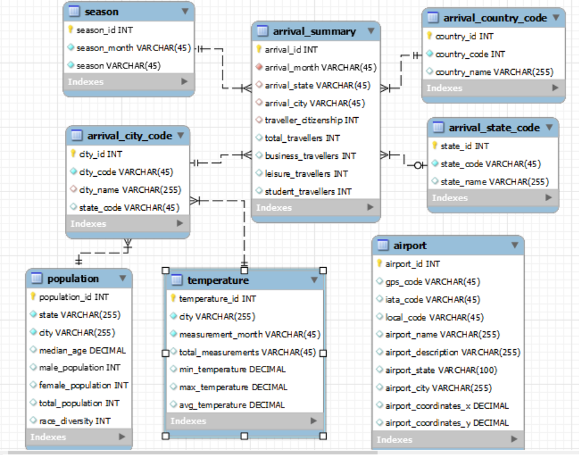
<br/>

<p align="right">(<a href="#top">back to top</a>)</p>

<!-- ETL Pipeline -->
## ETL Pipeline

The ETL Pipeline consists of the following:
1) Load Respective Datasets and Perform Data Cleaning
2) Ingest Data to Respective Fact and Dimension Tables

<br />

### Load Respective Datasets and Perform Data Cleaning

<br/>

#### 194 Immigration Data

After loading the datasets from `*sas7bdat` files, we have a total of `808585` records and the following is the columns of the dataframe `df_immigration_agg`

```csv
arrival_month, i94cit, i94port, i94addr, total_travellers, business_travellers, leisure_travellers, student_travellers
```

<br/>

#### World Temperature Data

After loading the datasets from `GlobalLandTemperaturesByCity.csv` file, we have a total of `2976` records and the following is the columns of the dataframe `df_us_temp_agg`

```csv
country, city, month, month_name, total_recordings, min_temperature, max_temperature, avg_temperature, season
```

<br/>

#### US City Demographic Data

After loading the datasets from `us-cities-demographics.csv` file, we have a total of `595` records and the following is the columns of the dataframe `df_demographic_agg`

```csv
city, state, state_code, median_age, total_male, total_female, total_population, total_race, total_race_count
```

<br/>

#### Airport Code Data

After loading the datasets from `airport-codes_csv.csv` file, we have a total of `22747` records and the following is the columns of the dataframe `df_us_airport_agg`

```csv
id, gps_code, iata_code, local_code, name, type, country, state, city, coordinates_x, coordinates_y
```

<br/>

#### Arrival Country Code Data

After loading the datasets from `i94cntyl_traveller_country.map` file, we have a total of `289` records and the following is the columns of the dataframe `df_traveller_country`

```csv
country_code, country_name
```

<br/>

#### Arrival State Code Data

After loading the datasets from `i94addrl_arrival_airport_state.map` file, we have a total of `55` records and the following is the columns of the dataframe `df_airport_state`

```csv
state_code, state_name
```

<br/>

#### Arrival City Code Data

After loading the datasets from `i94prtl_arrival_airport_city.map` file, we have a total of `660` records and the following is the columns of the dataframe `df_airport_city`

```csv
city_code, city_name_with_state, city_name, state_code
```

<br/>

### Ingest Data to Respective Fact and Dimension Tables

<br/>

#### Arrival Summary Table 

The data for `Arrival Summary` table is derived from the `df_immigration_agg`. The following shows the data loaded into the tables:

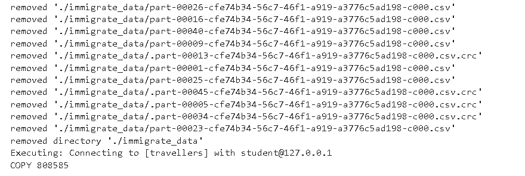

Summary:
> Total of `808585` rows were inserted to `Arrival Summary`

<br/>

#### Arrival State Code Table 

The data for `Arrival State Code` table is derived from the `df_airport_state`. The following shows the data loaded into the tables:

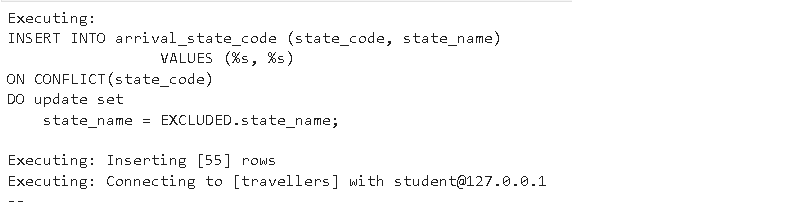

Summary:
> Total of `55` rows were inserted to `Arrival State Code`

<br/>

#### Arrival City Code Table 

The data for `Arrival City Code` table is derived from the `df_airport_city`.  The following shows the data loaded into the tables:

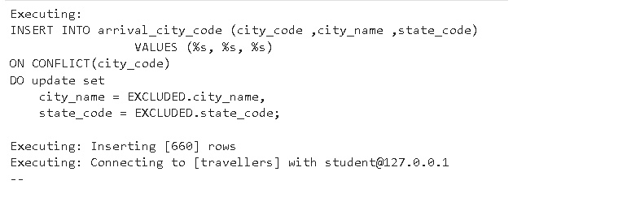

Summary:
> Total of `660` rows were inserted to `Arrival City Code`

<br/>

#### Arrival Country Code Table 

The data for `Arrival Country Code` table is derived from the `df_traveller_country`.  The following shows the data loaded into the tables:

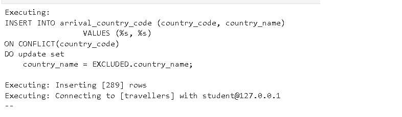

Summary:
> Total of `289` rows were inserted to `Arrival Country Code`

<br/>

#### Season Table 

The data for `Season` table is derived from the `df_us_temp_agg`. The following shows the data loaded into the tables:

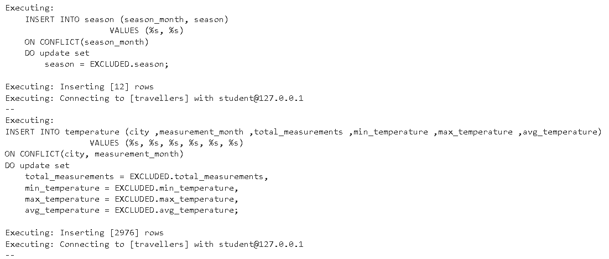

Summary:
> Total of `12` rows were inserted to `Season`

<br/>

#### Temperature Table 

The data for `Temperature` table is derived from the `df_us_temp_agg`. The following shows the data loaded into the tables:


Summary:
> Total of `2976` rows were inserted to `Temperature`

<br/>

#### Population Table 

The data for `Population` table is derived from the `df_demographic_agg`. The following shows the data loaded into the tables:

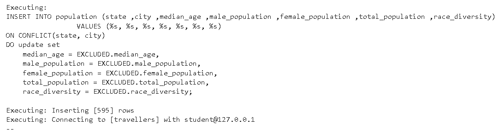

Summary:
> Total of `595` rows were inserted to `Population`

<br/>

#### Airport Table 

The data for `Airport` table is derived from the `df_us_airport_agg`. The following shows the data loaded into the tables:

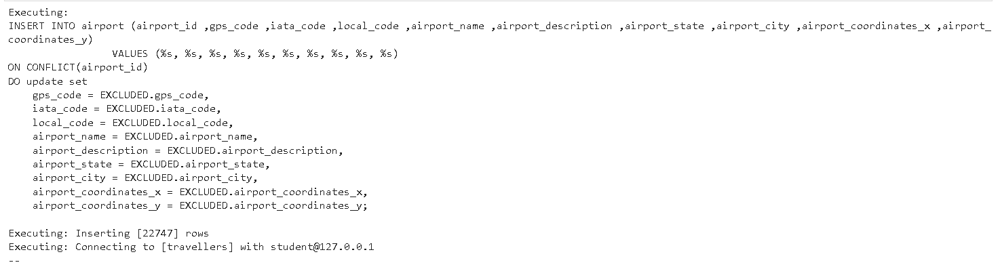

Summary:
> Total of `22747` rows were inserted to `Airport`

<br/>

<p align="right">(<a href="#top">back to top</a>)</p>

<!-- Data Quality -->
## Data Quality

The following are some checks to ensure that the tables are created correctly:
1) Total Count Check

<br/>

### Arrival Summary Table

The following is the total records found in `Arrival Summary` table:

Insert Result: 


<br/>

Check Result:

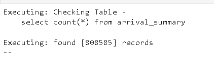

<br />

Verification:
> Dataframe has `808585` rows and corresponds to the database tables, which also have `808585` rows

<br/>

### Arrival State Code Table 

The following is the total records found in `Arrival State Code` table:

Insert Result: 


<br/>

Check Result:

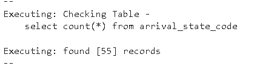

<br />

Verification:
> Dataframe has `55` rows and corresponds to the database tables, which also have `55` rows

<br/>

### Arrival City Code Table

The following is the total records found in `Arrival City Code` table:

Insert Result: 


<br/>

Check Result:

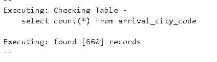

<br />

Verification:
> Dataframe has `660` rows and corresponds to the database tables, which also have `660` rows

<br/>

### Arrival Country Code Table

The following is the total records found in `Arrival Country Code` table:

Insert Result: 


<br/>

Check Result:

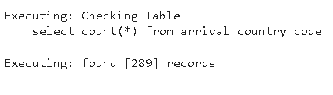

<br />

Verification:
> Dataframe has `289` rows and corresponds to the database tables, which also have `289` rows

<br/>

### Season Table 

The following is the total records found in `Season` table:

Insert Result: 


<br/>

Check Result:


<br />

Verification:
> Dataframe has `12` rows and corresponds to the database tables, which also have `12` rows

<br/>

### Temperature Table 

The following is the total records found in `Temperature` table:

Insert Result: 


<br/>

Check Result:

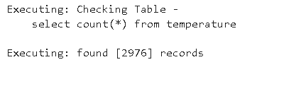

<br />

Verification:
> Dataframe has `2976` rows and corresponds to the database tables, which also have `2976` rows

<br/>

### Population Table 

The following is the total records found in `Population` table:

Insert Result: 


<br/>

Check Result:


<br />

Verification:
> Dataframe has `595` rows and corresponds to the database tables, which also have `595` rows

<br/>

### Airport Table

The following is the total records found in `Airport` table:

Insert Result: 


<br/>

Check Result:


<br />

Verification:
> Dataframe has `22747` rows and corresponds to the database tables, which also have `22747` rows

<p align="right">(<a href="#top">back to top</a>)</p>

<!-- Use Case -->
# Use Case

The following are some of the use cases for the datasets:
1) Top 5 Countries Visitor
2) Top 5 Cities Attaction
3) Relationship of Season and Travelling Patterns

<p align="right">(<a href="#top">back to top</a>)</p>

<!-- use-case-1 -->
## Use Case 1

The first use case is to find the 5 countries, whose most frequent visited United States in 2016

The following is the query and the output for the use case:

Query:

```sql
select s.traveller_citizenship, c.country_name, sum(s.total_travellers) as yearly_travellers
from arrival_summary s
    left join arrival_country_code c on s.traveller_citizenship = c.country_code
group by s.traveller_citizenship, c.country_name
order by yearly_travellers desc
limit 5;
```

<br />

Output: 
> 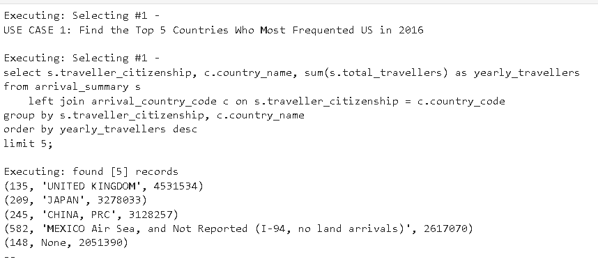

<br />

Insights:
> We have most of our visitors from UK, Japan and China

<p align="right">(<a href="#top">back to top</a>)</p>

<!-- use-case-2 -->
## Use Case 2

The second use case is to find the 5 cities, where travellers most frequent visited in 2016

The following is the query and the output for the use case:

Query:

```sql
select s.arrival_city, cc.city_name, cc.state_code, 
    sc.state_name, sum(s.total_travellers) as yearly_travellers
from arrival_summary s
    left join arrival_city_code cc on s.arrival_city = cc.city_code
    left join arrival_state_code sc on trim(sc.state_code) = trim(cc.state_code)
group by  s.arrival_city, cc.city_name, cc.state_code, 
    sc.state_name
order by yearly_travellers desc
limit 5;
```

<br />

Output: 
> 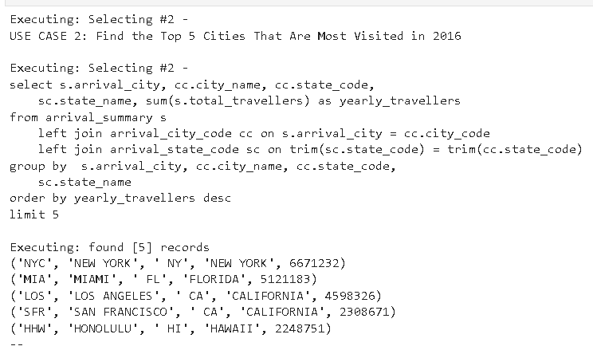

<br />

Insights:
> Most visitors like to visit New York, Miami and Los Angeles

<p align="right">(<a href="#top">back to top</a>)</p>

<!-- use-case-3 -->
## Use Case 3

The third use case is to study if there is any relationship between the various season and travelling purposes

The following is the query and the output for the use case:

Query:

```sql
select a.arrival_month, s.season,
	sum(a.total_travellers) as total_travellers,
	sum(a.business_travellers) as business_travellers,
	sum(a.leisure_travellers) as leisure_travellers,
	sum(a.student_travellers) as student_travellers
from arrival_summary a
	left join season s on  a.arrival_month = s.season_month
group by a.arrival_month, s.season
order by EXTRACT(MONTH FROM to_date(a.arrival_month, 'Month'))
```

<br />

Output: 
> 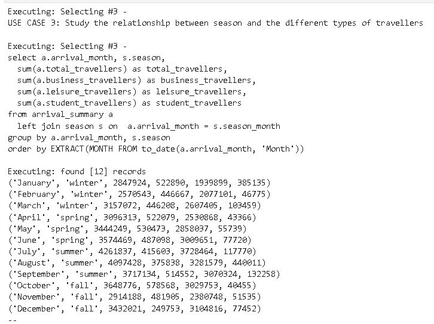

<br />

Insights:
> There is large increase in the number of students travellers in August, most likely due to the start of the new term. Also, the business travellers significantly reduced during december, likely because everybody is in the holiday mood and take long leave from work.

<p align="right">(<a href="#top">back to top</a>)</p>

<!-- Scenario Study -->
# Scenario Study

The following scenarios are some of the concerns that were raised during the design
1) Data increased by 100x
2) Data must be updated by 7am every day
3) Data need to be accessed by 100+ people

<p align="right">(<a href="#top">back to top</a>)</p>

<!-- scenario-1 -->
## Scenario 1

The first scenario is that when the data increased by 100x.

>The data amount will surmount to big data (one million x 100 = hundred million). Assuming the data stored in any storage is approximately 1kb, hundred million will means that the storage alone would require almost close to 100 TB (hundred million * 1kb) of storage space, which is impossible to store in just 1 machine.
<br /><br />
We will need to be running spark to process the data and ingesting it into our storage as the standard notebook would not be able to handle such a large amount of data either due to the limitation of its memory or its storage. By leveraging on spark, we not only able to break down the big tasks into smaller tasks which are doable in most compute, but also allows the data to be stored in a distributed manner, thus allowing higher availablilty (if one machine storing the data crashed, there is another one that have a copy) through replication.

<p align="right">(<a href="#top">back to top</a>)</p>

<!-- scenario-2 -->
## Scenario 2

The second scenario is that the data must be update by 7am every day.

>We can use airflow and configure a airflow job which will run at 7am every day to update the data required for the dashboard. In addition, we can redirect any fail job to any notifications so that we would know that the update job need to be retrigger manually and that there might be some reason that the update could not complete automatically

<p align="right">(<a href="#top">back to top</a>)</p>

<!-- scenario-3 -->
## Scenario 3

The final scenario is that the data must be accessed by 100+ people.

>We will probably need to have a load balancer to cater to the 100+ people so that our service would not be overwhelm. Alternatively if the data are static and don't change much, we can consider introducing a caching mechanism so that the result can be quickly return to the user.
<br /><br />
Another point to note is that if the data is not sensitive, we might also want to consider using cloud services such as AWS Elastic Load Balancer, which have an auto scaling feature that would be handy depending on the number of concurrent calls. That way, we won't have to worry about the user overwhelming the services, which retrieve the data.

<p align="right">(<a href="#top">back to top</a>)</p>

<!-- ACKNOWLEDGMENTS -->
## Acknowledgments

Here are some resources that have helped in completing this project!

* [Readme Template](https://github.com/othneildrew/Best-README-Template/blob/master/README.md)
* [194 Immigration Data](https://www.trade.gov/national-travel-and-tourism-office)
* [World Temperature Data](https://www.kaggle.com/datasets/berkeleyearth/climate-change-earth-surface-temperature-data)
* [U.S. City Demographic Data](https://public.opendatasoft.com/explore/dataset/us-cities-demographics/export/)
* [Airport Code Table](https://datahub.io/core/airport-codes#data)
* [US Seasonality 2022](https://www.calendarr.com/united-states/seasons-of-the-year-in-the-united-states/#:~:text=Fall%3A%20Starts%20on%20March%2020,until%20March%2020%20or%2021.)
* [Convert SAS Numeric to Python Datetime](https://stackoverflow.com/questions/48510058/converting-numeric-sas-dates-to-datetimes-pandas)
* [Boosting PySpark Performance](https://towardsdatascience.com/apache-spark-performance-boosting-e072a3ec1179)
* [Bulk Insert Dataframe](https://naysan.ca/2020/05/09/pandas-to-postgresql-using-psycopg2-bulk-insert-performance-benchmark/)
* [Fetch All Postgresql Result](https://www.postgresqltutorial.com/postgresql-python/query/)

<br/>

<p align="right">(<a href="#top">back to top</a>)</p>
